# Workflow Git et GitHub

<!--
_class: lead
_paginate: false
-->

<https://github.com/heig-vd-devapplis-course/heig-vd-devapplis-course>

Visualiser le contenu complet sur GitHub [à cette
adresse][contenu-complet-sur-github].

<small>L. Delafontaine, avec l'aide de
[GitHub Copilot](https://github.com/features/copilot).</small>

<small>Ce travail est sous licence [CC BY-SA 4.0][license].</small>

![bg opacity:0.05][illustration-principale]

## Utiliser Git et GitHub de façon efficace (1/3)

- Jusqu'à présent, vous avez utilisé Git et GitHub dans le cadre de plusieurs
  cours/projets.
- Parfois, plus ou moins de succès...
- Dans ce cours, nous souhaitons vous présenter un workflow de développement
  simple et efficace pour travailler en équipe.

![bg right:40%][illustration-principale]

## Utiliser Git et GitHub de façon efficace (2/3)

- Il existe 1000 manières de travailler avec Git et GitHub.
- Nous n'avons pas la prétention de vous présenter la meilleure manière de
  faire, mais plutôt une manière simple et efficace.
- Elle reprend ce que vous avez utilisé en ProgServ1 2025-2026.

![bg right:40%][illustration-principale]

## Utiliser Git et GitHub de façon efficace (3/3)

- Ce workflow est basé sur les bonnes pratiques de développement professionnel.
- Il est conçu pour être simple à comprendre et à mettre en œuvre.
- Cela n'empêchera pas d'avoir des conflits de fusion, mais cela facilitera leur
  résolution.

![bg right:40%][illustration-principale]

## Différences entre Git et GitHub (1/2)

- Git est un système de contrôle de version qui permet de suivre les
  modifications dans le code source.
- GitHub est une plateforme en ligne qui repose sur Git pour collaborer.
- GitHub offre de nombreuses fonctionnalités, c'est ce que nous allons étudier
  aujourd'hui.

![bg right:40%][illustration-principale]

## Différences entre Git et GitHub (2/2)

Git est un _"système distribué"_, ce qui signifie que le code peut être stocké à
plusieurs endroits :

- Un dépôt local sur votre machine.
- Un dépôt distant sur GitHub.

Le code peut être synchronisé entre les deux pour partager le travail.

![bg right:40%][illustration-principale]

## Commits, push et pull

- Un commit est une "capture" de l'état de votre code à un instant $t$.
- Plusieurs commits qui se suivent forment une branche.
- Un push est l'action d'envoyer vos commits locaux vers le dépôt distant sur
  GitHub.
- Un pull est l'action de récupérer les commits du dépôt distant vers votre
  dépôt local.

![bg right:40%][illustration-principale]

## Issues (1/3)

- Les issues sont des tickets pour suivre les tâches à réaliser.
- Utilisées pour signaler des bugs, proposer des améliorations ou discuter de
  nouvelles fonctionnalités.
- Elles sont très utiles pour organiser le travail en équipe et répartir les
  tâches entre les membres de l'équipe.

![bg right:40%][illustration-principale]

## Issues (2/3)

- Les issues permettre de suivre les tâches à réaliser, même si vous travaillez
  seul.e.
- Elles vous permettent de garder une trace de ce que vous avez fait et de ce
  qu'il reste à faire.
- Elles facilitent la communication avec les autres membres de l'équipe.

![bg right:40%][illustration-principale]

## Issues (3/3)

- Utilisez les issues pour suivre les tâches à réaliser.
- Créez une issue pour chaque tâche à réaliser.
- Distribuez les issues entre les membres de l'équipe.
- Videz votre cerveau pour ne rien oublier !

![bg right:40%][illustration-principale]

## Branches (1/3)

- Les branches permettent de travailler sur différentes fonctionnalités ou
  corrections de bugs sans affecter la branche principale (main).
- La branche principale (main) doit toujours être dans un état fonctionnel.
- Chaque branche représente une ligne de développement distincte.

![bg right:40%][illustration-principale]

## Branches (2/3)

- Les branches permettent de tester des idées sans risquer de casser le code
  principal.
- Elles facilitent la collaboration en permettant à plusieurs personnes de
  travailler sur différentes parties du projet en même temps.
- Il est possible de créer une branche directement depuis une issue.

![bg right:40%][illustration-principale]

## Branches (3/3)

- Chaque personne responsable d'une issue doit créer une branche pour travailler
  sur cette issue.
- GitHub génère automatiquement un nom de branche à partir du titre de l'issue.
- Basculez localement sur la branche pour travailler sur l'issue.
- Commitez régulièrement vos modifications sur cette branche.

![bg right:40%][illustration-principale]

## Pull requests (1/3)

- Une pull request est une demande de fusion d'une branche dans la branche
  principale (main).
- Elle permet de revoir le code avant de le fusionner dans la branche
  principale.
- C'est un moment important pour discuter des modifications apportées et
  s'assurer que le code est de qualité.

![bg right:40%][illustration-principale]

## Pull requests (2/3)

- Après le premier push, GitHub vous propose de créer une pull request avec les
  modifications.
- GitHub devrait lier la pull request à l'issue correspondante.
- La pull request doit être revue avant d'être fusionnée.
- Une fois fusionnée, la branche peut être supprimée.

![bg right:40%][illustration-principale]

## Pull requests (3/3)

- Utilisez les pull requests pour visualiser vos modifications.
- Chaque pull request est indépendante, ce qui facilite la revue de code.
- Les pull requests permettent de maintenir la qualité du code et de faciliter
  la collaboration entre les membres de l'équipe.

![bg right:40%][illustration-principale]

## Revue de code (1/2)

- Les pull requests permettent de demander une revue de code avant de fusionner
  vos modifications.
- Il est possible de demander à une ou plusieurs personnes de revoir votre code
  en les ajoutant comme "reviewer" de la pull request.
- Il est possible de commenter des lignes spécifiques du code et de demander des
  améliorations.

![bg right:40%][illustration-principale]

## Revue de code (2/2)

- La revue de code permet d'améliorer la qualité du code et de partager les
  connaissances au sein de l'équipe.
- N'hésitez pas à demander des commentaires sur votre code et à commenter le
  code des autres en mettant l'autre personne "reviewer" de la pull request.

![bg right:40%][illustration-principale]

## Fusion de code (1/4)

- Une fois que la pull request approuvée, elle peut être fusionnée dans la
  branche principale (main).
- La fusion de code permet d'intégrer les modifications dans la branche
  principale tout gardant un historique clair et compréhensible.
- Après la fusion, la branche de travail peut être supprimée pour éviter
  l'encombrement.

![bg right:40%][illustration-principale]

## Fusion de code (2/4)

- La branche principale (main) doit toujours être dans un état fonctionnel.
- GitHub propose plusieurs options de fusion :
  - Merge commit.
  - Squash and merge.
  - Rebase and merge.

![bg right:40%][illustration-principale]

## Fusion de code (3/4)

- Merge : garde tous les commits de la branche, ce qui peut rendre l'historique
  plus difficile à lire.
- Squash : combine tous les commits de la branche en un seul commit, ce qui rend
  l'historique plus propre.
- Rebase : méthode avancée de fusion qui réécrit l'historique.

![bg right:40%][illustration-principale]

## Fusion de code (4/4)

- Nous recommandons d'utiliser l'option "Squash and merge" pour garder un
  historique propre et éviter les commits intermédiaires inutiles.
- Cette option permet de combiner tous les commits d'une branche en un seul
  commit lors de la fusion, ce qui facilite la lecture de l'historique du
  projet.

![bg right:40%][illustration-principale]

## Conflits de fusion (1/3)

- Parfois, il peut y avoir des conflits de fusion lorsque deux branches
  modifient les mêmes choses.
- GitHub vous indiquera qu'il y a un conflit et vous devrez le résoudre
  manuellement.
- La résolution de conflits peut être délicate, mais c'est une compétence
  importante à maîtriser.

![bg right:40%][illustration-principale]

## Conflits de fusion (2/3)

- Lorsqu'un conflit de fusion se produit, GitHub et/ou Visual Studio Code vous
  montrera les fichiers en conflit et les parties du code qui posent problème.
- Vous devrez décider comment résoudre le conflit en choisissant quelle version
  du code conserver ou en combinant les deux versions.

![bg right:40%][illustration-principale]

## Conflits de fusion (3/3)

- Une fois le conflit résolu, vous devrez commiter les modifications pour
  finaliser la fusion.
- Illustrons ce processus avec un scénario réaliste de workflow Git et GitHub
  avec gestion de conflit.

![bg right:40%][illustration-principale]

---

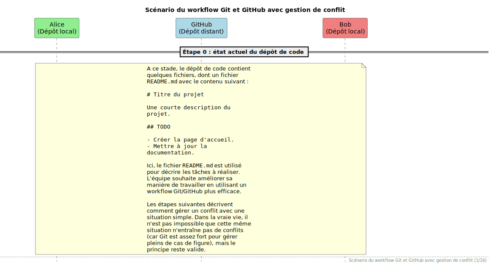

---

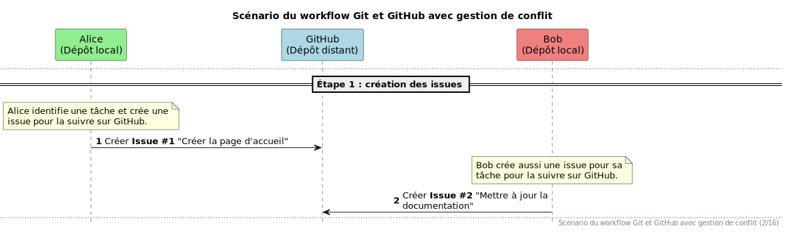

---

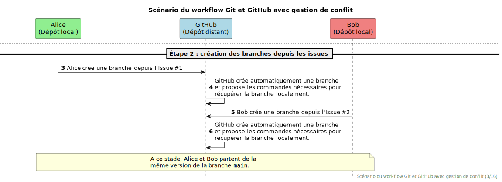

---

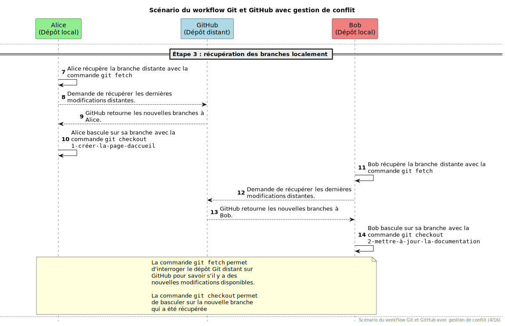

---

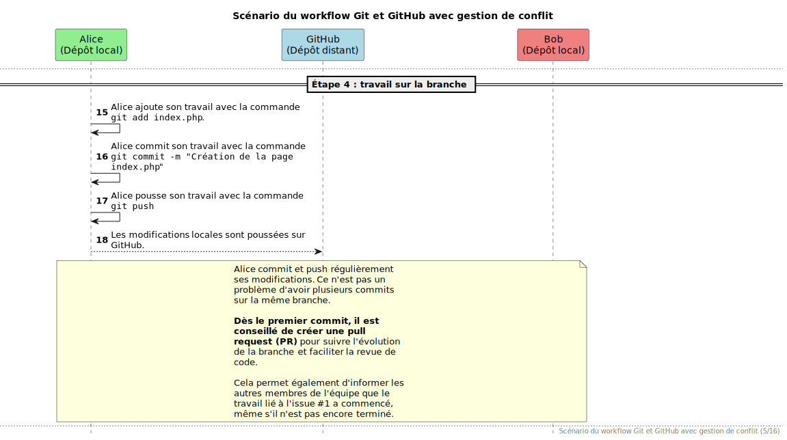

---

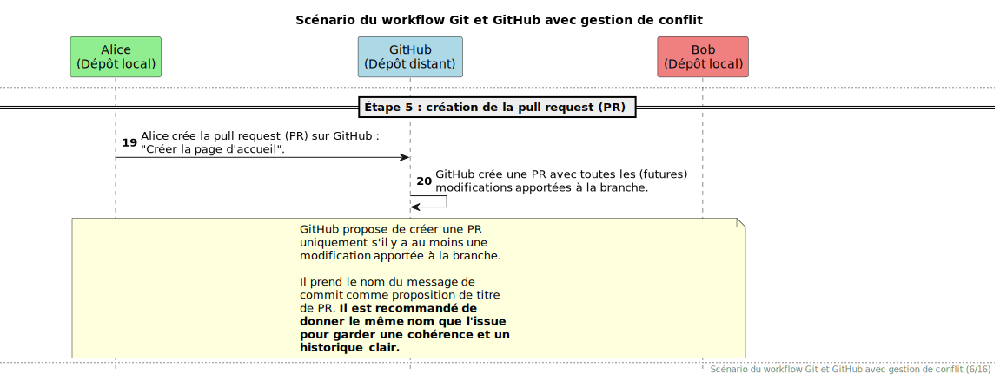

---

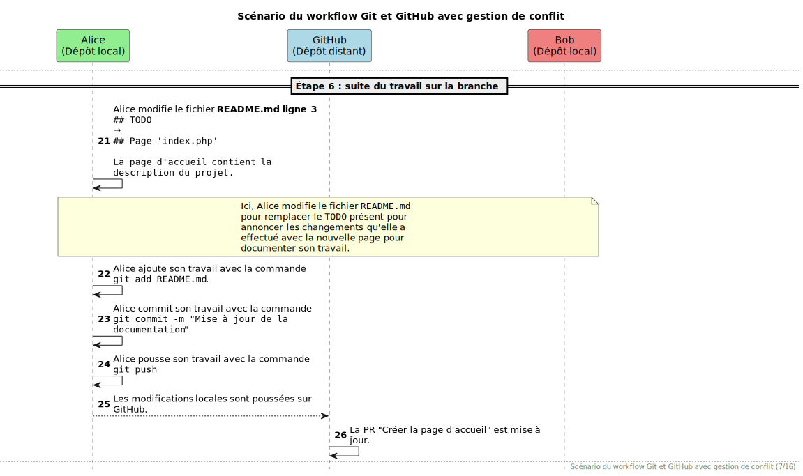

---

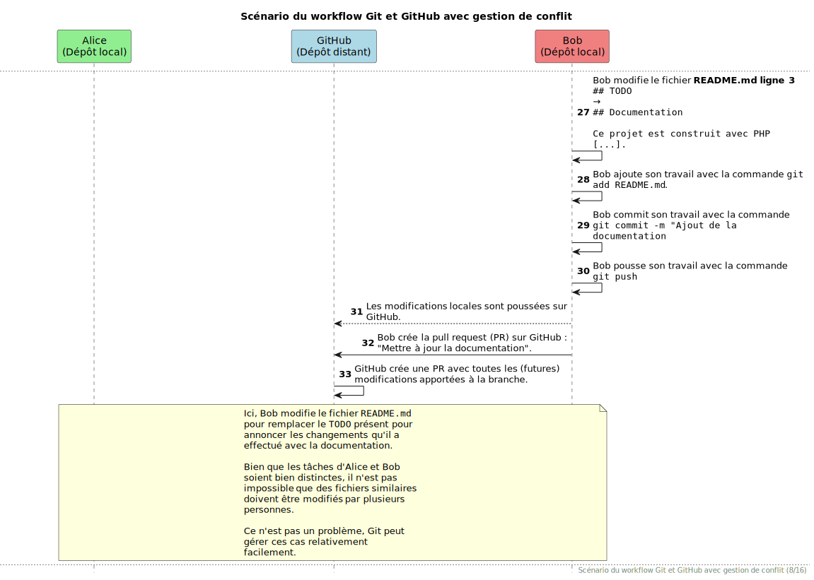

---

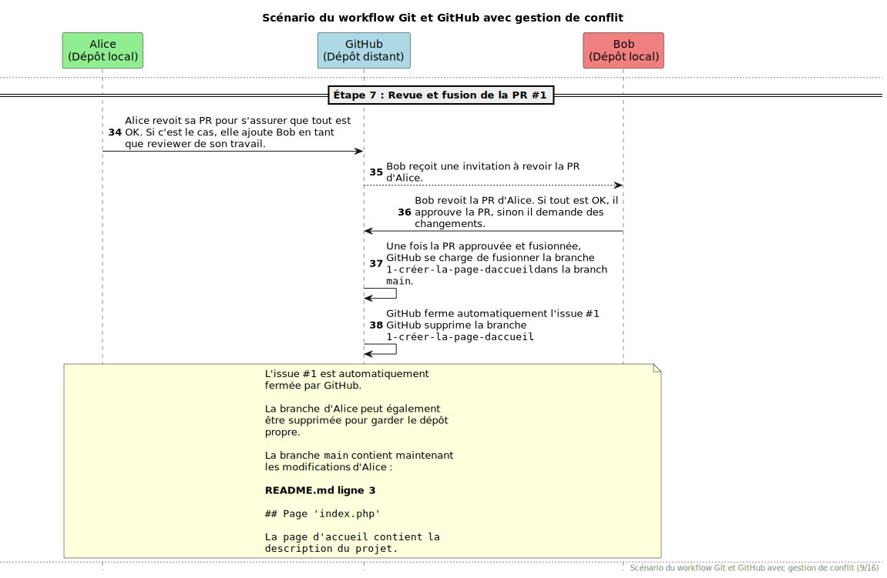

---

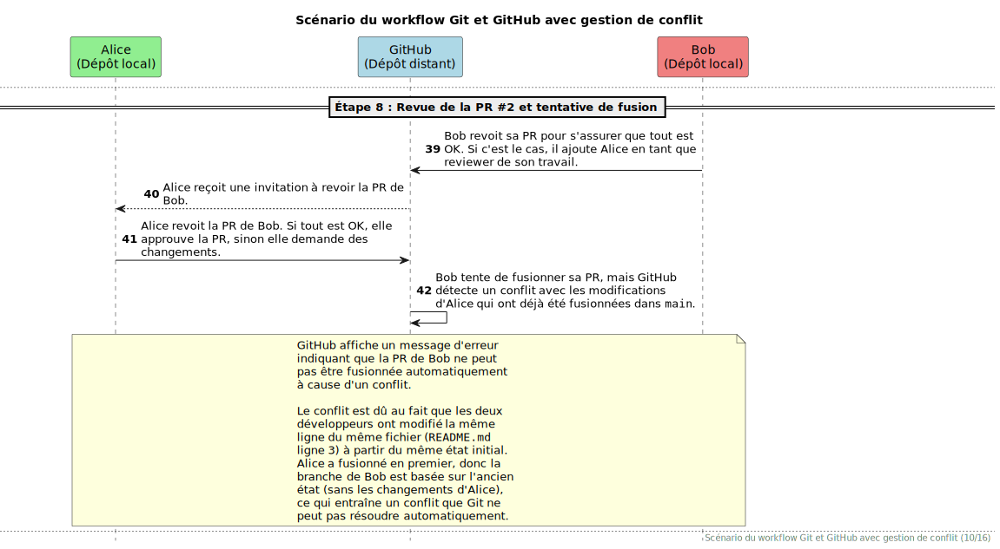

---

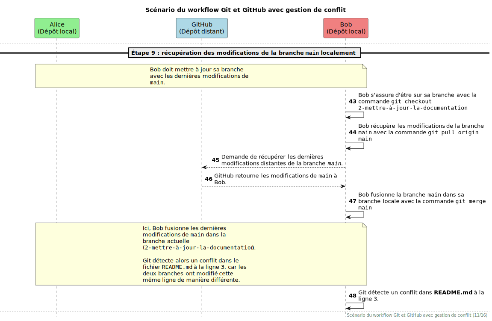

---

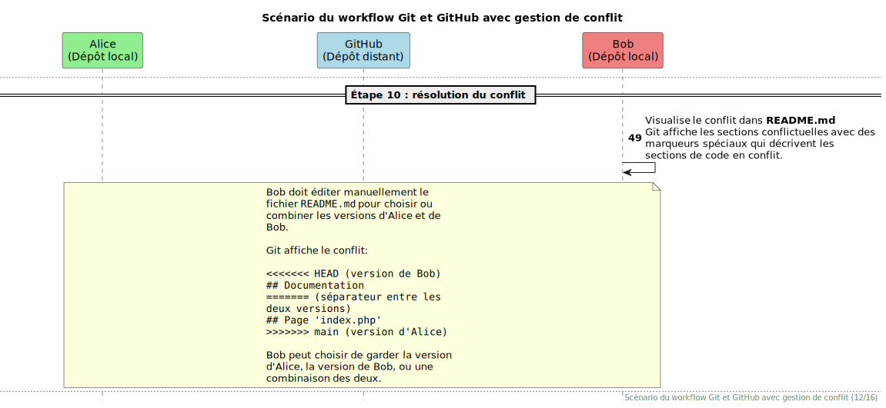

---

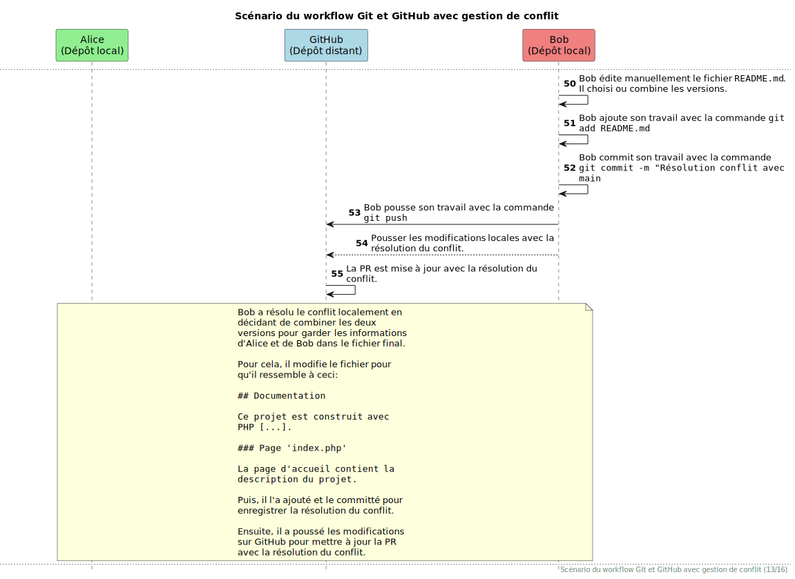

---

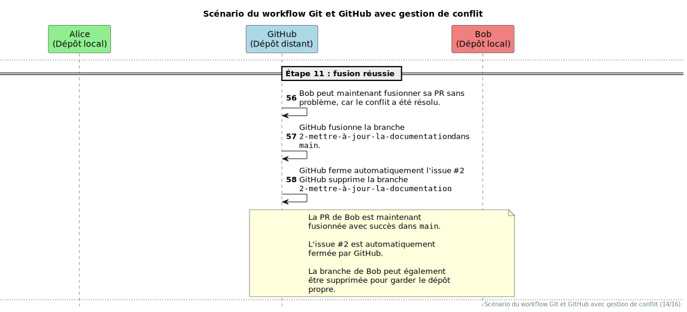

---

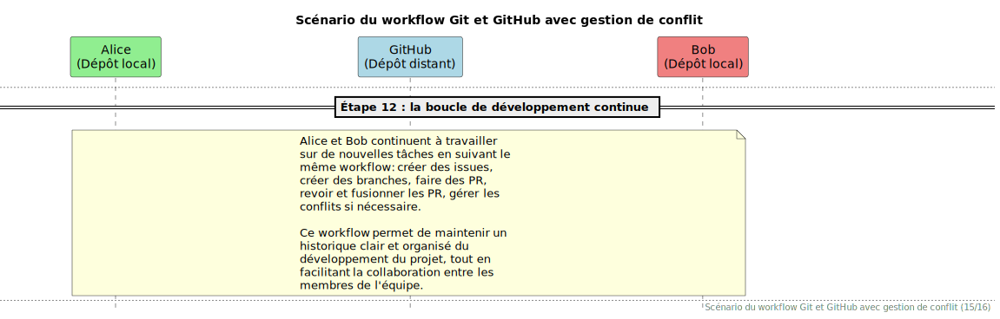

---

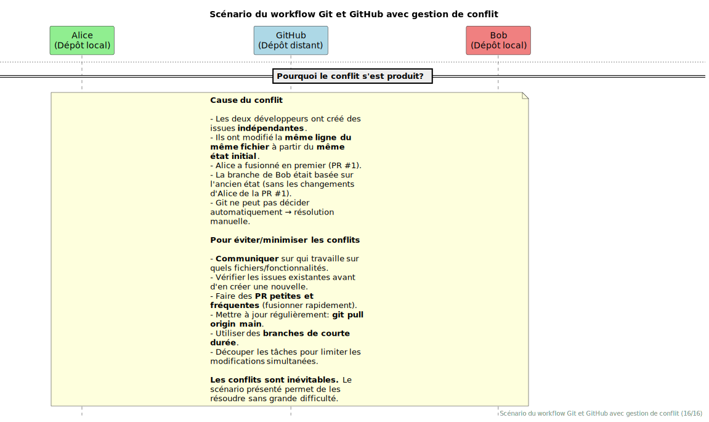

## Résumé du workflow

1. Créer une issue pour chaque tâche à réaliser.
2. En temps voulu, créer une branche depuis chaque issue.
3. Travailler sur la branche et commiter régulièrement.
4. Créer une pull request pour fusionner la branche dans main.
5. Demander une revue de code et adapter si besoin.
6. Une fois approuvée, fusionner la pull request.
7. Supprimer la branche utilisée par la pull request.
8. Répéter ce processus pour chaque tâche à réaliser.

## Forcer ces pratiques avec GitHub

GitHub permet de forcer l'utilisation de ces pratiques, par exemple :

- Protéger la branche principale (main) pour éviter de pouvoir y faire des
  commits directs.
- Obliger de passer via des pull requests.
- Obliger d'avoir au moins une approbation avant de pouvoir fusionner une pull
  request.
- Supprimer automatiquement les branches après la fusion.
- La documentation de GitHub vous guide dans la configuration de ces règles :
  [1](https://docs.github.com/en/repositories)
  [2](https://docs.github.com/en/repositories/configuring-branches-and-merges-in-your-repository/managing-protected-branches/about-protected-branches)
  [3](https://docs.github.com/en/repositories/configuring-branches-and-merges-in-your-repository/configuring-pull-request-merges/managing-the-automatic-deletion-of-branches)
  [4](https://docs.github.com/en/repositories/configuring-branches-and-merges-in-your-repository/configuring-pull-request-merges/about-merge-methods-on-github).

## Markdown (1/2)

- Markdown est un langage de balisage léger qui permet de formater du texte de
  manière simple.
- Markdown est supporté par GitHub et Visual Studio Code pour les fichiers
  README, les issues, les pull requests, etc.
- Une
  [documentation complète sur Markdown](https://docs.github.com/en/get-started/writing-on-github)
  est là pour vous aider.

![bg right:40%][illustration-principale]

## Markdown (2/2)

- Apprenez les bases de Markdown pour formater vos README et autres documents.
- Utilisez des titres, des listes à puces, des liens, des images, etc. pour
  rendre votre documentation plus lisible.
- Utilisez Markdown pour rédiger de la documentation claire et structurée pour
  votre projet.

![bg right:40%][illustration-principale]

## GitHub Classroom, Visual Studio et Docker

- GitHub Classroom est un outil qui permet de créer des dépôts GitHub dans un
  contexte éducatif.
- Il permet de suivre les progrès des étudiant.es et de gérer les dépôts de
  manière centralisée depuis des modèles de dépôt.
- Le dépôt créé pour votre groupe contient déjà des fichiers de configuration
  pour utiliser un conteneur de développement avec Visual Studio Code et Docker.
- Le README fournit des instructions pour configurer votre environnement de
  développement local pour PHP et SQLite. **Si vous avez des soucis, faites-le
  nous savoir.**

## Questions

<!-- _class: lead -->

Est-ce que vous avez des questions ?

## Sources

- [Illustration principale][illustration-principale] par
  [Growtika](https://unsplash.com/@growtika) sur
  [Unsplash](https://unsplash.com/photos/a-computer-with-a-keyboard-and-mouse-yGQmjh2uOTg)

<!-- URLs -->

[license]:
	https://github.com/heig-vd-devapplis-course/heig-vd-devapplis-course/blob/main/LICENSE.md
[contenu-complet-sur-github]:
	https://github.com/heig-vd-devapplis-course/heig-vd-devapplis-course/blob/main/01-contenus-du-cours/02-workflow-git-et-github/README.md

<!-- Illustrations -->

[illustration-principale]:
	https://images.unsplash.com/photo-1669023414162-5bb06bbff0ec?fit=crop&h=720
